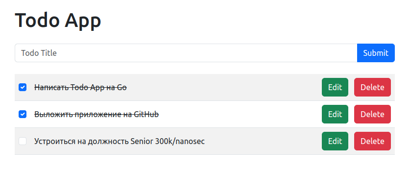

# Go Todo App



This is a simple CRUD (Create, Read, Update, Delete) web application written in Go, using MongoDB as the database. The
application exposes a RESTful API for managing todo items.

## 📄 Prerequisites

- Docker installed on your machine.

## ⚡️ Quick start

1. Clone and open the repository:

```bash
git clone https://github.com/sonochiwa/go-todo.git && cd go-todo 
```

2. Build and run the application:

```bash
docker compose build && docker compose up -d
```

The application will be accessible at [localhost:9000](http://localhost:9000)

## 🛠 API Endpoints

- **GET /todos**: Retrieve all todo items.
- **GET /todos/{todo_id}**: Retrieve todo item by id.
- **POST /todos**: Create a new todo item.
- **PUT /todos/{todo_id}**: Update a todo item.
- **DELETE /todos/{todo_id}**: Delete a todo item.

## ⚠️ License

This project is licensed under the MIT License - see the [LICENSE](LICENSE) file for details.
